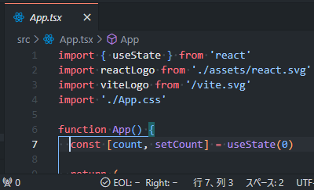
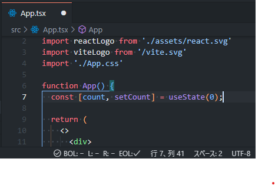
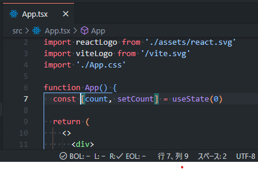
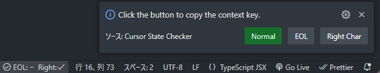

# Cursor State Checker

[日本語版README](./README.ja.md)

## Features

Checks the cursor's position in the editor and sets the context.  
You can use these contexts in `when` conditions for keyboard shortcuts.

| State                                                                                                                                                 | Context Key                    | Checked Characters                              |
| :---------------------------------------------------------------------------------------------------------------------------------------------------- | :----------------------------- | :---------------------------------------------- |
| Normal (neither case)                                                                                                                                 | CSChecker.normal               |                                                 |
| Cursor is at the end of the line                                                                                                                      | CSChecker.eol                  |                                                 |
| The character immediately to the right of the cursor (next) is a specific character (quote, bracket/tag) or a space followed by a specific character. | CSChecker.rightIsSpecifiedChar | `"'``(){}[]<>`<br>※ Can be changed via settings |

<details>
<summary>Usage example of context keys</summary>

In normal cases, use `cursorWordEndRight` to move the cursor word by word.  
When a specific character or a space followed by a specific character is to the right of the cursor, you can move to the next character using `cursorRight`.  
When at the end of the line, the default behavior occurs, and a `space` is inserted.

```json
{
  "key": "shift+space",
  "command": "cursorWordEndRight",
  "when": "textInputFocus && !accessibilityModeEnabled && CSChecker.normal"
},
{
  "key": "shift+space",
  "command": "cursorRight",
  "when": "textInputFocus && !accessibilityModeEnabled && CSChecker.rightIsSpecifiedChar"
}
```
</details>


### Status Bar

The status bar will display whether the cursor is in the EOL/Right state based on its position.  
Clicking on the status bar allows you to copy each context key to the clipboard.

#### Normal



#### End of Line



#### A specified character is to the right (next)



#### Clicking the status bar



## Settings

This extension provides the following settings:

| Key                                          | Description                                        | Default Value  |
| :------------------------------------------- | :------------------------------------------------- | :------------- |
| `check-cursor-state.enabled`                 | Enable/Disable the extension                       | true           |
| `check-cursor-state.rightOfCursorCheckChars` | Characters to check for to the right of the cursor | `"'``(){}[]<>` |
|                                              |                                                    |                |

## Release Notes

### 0.0.1

Initial release.

## License

* MIT
