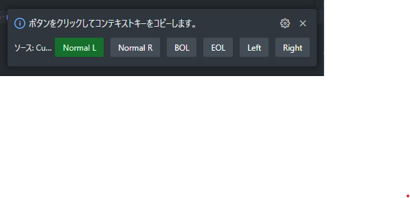

# Cursor State Checker

[日本語版README](./README.ja.md)

## Features

Checks the cursor's position in the editor and sets the context.  
You can use these contexts in `when` conditions for keyboard shortcuts.

Here is the English translation:

| State                                                                                                                                       | Context Key                    | Characters to Check                            |
| :------------------------------------------------------------------------------------------------------------------------------------------ | :----------------------------- | :--------------------------------------------- |
| The area to the right of the cursor is normal (not at the beginning of the line, no specific characters)                                    | CSChecker.normalLeft           |                                                |
| The area to the left of the cursor is normal (not at the beginning of the line, no specific characters)                                     | CSChecker.normalRight          |                                                |
| The cursor is at the beginning of the line                                                                                                  | CSChecker.bol                  |                                                |
| The cursor is at the end of the line                                                                                                        | CSChecker.eol                  |                                                |
| The character to the left (previous) of the cursor is a specific character (quote, bracket/tag) or a space followed by a specific character | CSChecker.leftIsSpecifiedChar  | `"'``(){}[]<>`<br>*Can be changed in settings* |
| The character to the right (next) of the cursor is a specific character (quote, bracket/tag) or a space followed by a specific character    | CSChecker.rightIsSpecifiedChar | `"'``(){}[]<>`<br>*Can be changed in settings* |
<details>
<summary>Usage example of context keys</summary>

In normal cases, use `cursorWordEndRight` to move the cursor word by word.  
When a specific character or a space followed by a specific character is to the right of the cursor, you can move to the next character using `cursorRight`.  
When at the end of the line, the default behavior occurs, and a `space` is inserted.

```json
{
  "key": "shift+space",
  "command": "cursorWordEndRight",
  "when": "textInputFocus && !accessibilityModeEnabled && CSChecker.normal"
},
{
  "key": "shift+space",
  "command": "cursorRight",
  "when": "textInputFocus && !accessibilityModeEnabled && CSChecker.rightIsSpecifiedChar"
}
```
</details>


### Status Bar

The cursor position determines the state displayed in the status bar.  
By clicking the status bar, you can copy each context key to the clipboard.

Here is the English translation:

#### Beginning of the Line


#### End of the Line


#### Specific Character to the Left


#### Specific Character to the Right


#### Clicking the status bar



## Settings

This extension provides the following settings:

Here is the English translation:

| Key                                          | Description                                    | Default Value  |
| :------------------------------------------- | :--------------------------------------------- | :------------- |
| `check-cursor-state.enabled`                 | Enable/Disable the extension                   | true           |
| `check-cursor-state.leftOfCursorCheckChars`  | Characters to check to the left of the cursor  | `"'``(){}[]<>` |
| `check-cursor-state.rightOfCursorCheckChars` | Characters to check to the right of the cursor | `"'``(){}[]<>` |
## Release Notes

* see [CHANGELOG](CHANGELOG.md)

## License

* MIT
